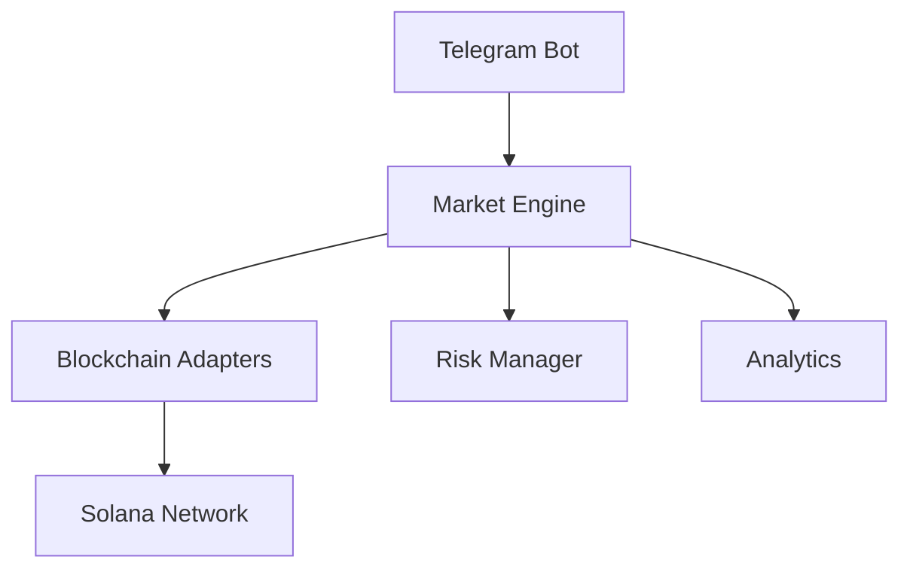

# System Architecture

## Core Components

## Data Flow
1. **Price Updates**:
    - DEX APIs → Market Data Service → Strategy Engine

2. **Trade Execution**:
    - User Command → Order Manager → JITO Bundler → Solana

3. **Monitoring**:
    - Chain Data → Alert Service → Telegram/Discord